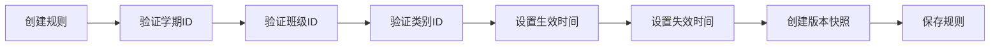

# 积分规则引擎优化报告

## 📋 任务概述

优化规则引擎关联学期/班级/时间戳，实现业务逻辑与执行策略的解耦，确保数据一致性和外键约束验证。

## ✅ 已完成功能

### 1. **规则与学期强制绑定**

**实现内容:**
- 规则创建时强制关联学期ID
- 自动加载当前学期信息
- 规则查询时按学期过滤
- 支持跨学期规则隔离

**核心代码:**
```javascript
// 强制验证：规则必须关联学期ID
if (!currentSemesterId && !formData.semester_id) {
  util.showError('规则必须关联学期ID');
  return;
}

// 按学期过滤规则
if (currentSemesterId) {
  baseQuery.semester_id = _.in([currentSemesterId, '', null]);
}
```

### 2. **规则与班级归属绑定**

**实现内容:**
- 班主任只能管理本班规则
- 支持全局规则（适用于所有班级）
- 班级权限校验
- 规则按班级维度隔离

**权限控制:**
```javascript
// 班主任权限校验：只能管理本班规则
if (userRole === 'head_teacher' && formData.class_id && formData.class_id !== userClassId) {
  util.showError('您只能管理本班的规则');
  return;
}
```

### 3. **生效时间戳管理**

**实现内容:**
- 支持设置规则生效日期
- 支持设置规则失效日期
- 自动过滤有效期外的规则
- 前端UI日期选择器

**有效期验证:**
```javascript
// 检查生效日期
if (rule.effective_date) {
  const effectiveDate = new Date(rule.effective_date);
  if (now < effectiveDate) return false;
}

// 检查失效日期
if (rule.expiry_date) {
  const expiryDate = new Date(rule.expiry_date);
  if (now > expiryDate) return false;
}
```

### 4. **外键约束验证**

**创建了云函数:** `cloudfunctions/validateRuleEngine`

**验证项目:**
- ✅ 验证班级ID是否存在（关联 `classes` 表）
- ✅ 验证学期ID是否存在（关联 `semesters` 表）
- ✅ 验证积分类别ID是否存在（关联 `score_categories` 表）
- ✅ 验证规则ID唯一性
- ✅ 验证学生学籍有效性（关联 `student_status` 表）
- ✅ 验证宿舍扣分项存在性（关联 `dorm_deduction_items` 表）

**核心验证函数:**
```javascript
// 云函数提供的验证接口
- validateRuleConstraints: 验证积分规则约束
- validateScoreRecord: 验证积分记录约束
- getActiveRules: 获取当前有效的规则
- validateDormRule: 验证宿舍管理规则
```

### 5. **积分类别关联**

**实现内容:**
- 从 `score_categories` 集合动态加载类别
- 支持全局类别和班级专属类别
- 规则保存时记录 `category_id`
- 类别外键约束验证

**类别加载逻辑:**
```javascript
// 查询积分类别，包括全局类别和当前班级的类别
const res = await db.collection('score_categories')
  .where(_.or([
    { class_id: _.exists(false) },  // 全局类别
    { class_id: '' },                // 全局类别
    { class_id: this.data.userClassId }  // 本班类别
  ]))
  .where({ is_active: true })
  .orderBy('sort_order', 'asc')
  .get();
```

### 6. **UI界面优化**

**规则表单新增字段:**
- 📅 关联学期（自动显示当前学期）
- 📅 生效日期选择器
- 📅 失效日期选择器
- 💡 智能提示和说明

**规则卡片元数据显示:**
- 🏫 学期信息
- 🏫 班级信息
- ⏰ 生效日期
- ⏰ 失效日期
- 🏷️ 有效期状态标签

## 📁 修改/创建的文件

### 前端页面
1. `miniprogram/pages/score/rules/rules.js` - 规则管理逻辑优化
2. `miniprogram/pages/score/rules/rules.wxml` - 规则表单和卡片UI
3. `miniprogram/pages/score/rules/rules.wxss` - 元数据显示样式

### 云函数
4. `cloudfunctions/validateRuleEngine/index.js` - 规则引擎验证云函数
5. `cloudfunctions/validateRuleEngine/package.json` - 云函数配置

## 🔍 数据一致性保障机制

### 1. **外键约束三级验证**

#### 前端验证（用户体验）
- 表单提交前验证
- 即时反馈错误信息
- 减少无效请求

#### 云函数验证（安全防护）
- 后端强制验证
- 防止绕过前端验证
- 保障数据完整性

#### 数据库设计（最终防线）
- 外键关联字段
- 索引优化查询
- 级联删除保护

### 2. **生命周期管理**



### 3. **隔离机制**

| 维度 | 实现方式 | 效果 |
|------|---------|------|
| 学期隔离 | `semester_id` 过滤 | 不同学期规则独立 |
| 班级隔离 | `class_id` 权限校验 | 班主任只能管理本班规则 |
| 时间隔离 | 生效/失效日期 | 规则自动激活/停用 |
| 类别隔离 | `category_id` 关联 | 规则与类别强绑定 |

## 🎯 业务规则引擎架构

### 核心原则
1. **强制关联:** 规则必须绑定学期ID
2. **权限隔离:** 基于班级的数据隔离
3. **时间约束:** 支持规则生命周期管理
4. **一致性保障:** 外键约束验证
5. **版本追溯:** 规则变更版本快照

### 数据流图

```
用户创建规则
    ↓
前端验证（表单验证）
    ↓
外键约束验证（云函数）
    ├─ 验证班级存在
    ├─ 验证学期存在
    ├─ 验证类别存在
    └─ 验证规则唯一性
    ↓
时间戳设置
    ├─ 生效日期
    └─ 失效日期
    ↓
创建版本快照
    ↓
保存到数据库
```

## 🚀 部署步骤

### 1. 部署云函数
```bash
cd cloudfunctions/validateRuleEngine
npm install
# 在微信开发者工具中右键"上传并部署:云端安装依赖"
```

### 2. 数据库准备
确保以下集合存在并正确初始化:
- ✅ `semesters` - 学期信息表
- ✅ `classes` - 班级信息表
- ✅ `score_categories` - 积分类别表
- ✅ `student_status` - 学籍信息表
- ✅ `dorm_deduction_items` - 宿舍扣分项表

### 3. 测试建议

#### 功能测试
- [ ] 创建规则时必须选择学期
- [ ] 班主任无法管理其他班级的规则
- [ ] 设置生效日期后规则在指定日期前不可用
- [ ] 设置失效日期后规则自动停用
- [ ] 外键约束验证生效

#### 数据一致性测试
- [ ] 删除班级时检查关联规则
- [ ] 删除学期时检查关联规则
- [ ] 删除类别时检查关联规则
- [ ] 规则ID唯一性验证

#### 权限测试
- [ ] 班主任只能查看本班规则
- [ ] 管理员可以查看所有规则
- [ ] 科任老师查看所教班级规则
- [ ] 学生/家长无权限访问

## 📊 数据库字段变更

### score_records 集合（规则记录）

**新增字段:**
```javascript
{
  semester_id: String,      // 关联学期ID（必填）
  category_id: String,      // 关联积分类别ID
  effective_date: Date,     // 生效日期
  expiry_date: Date,        // 失效日期
  created_by: String,       // 创建人openid
  updated_by: String,       // 更新人openid
  rule_version: String      // 规则版本号
}
```

**索引建议:**
```javascript
// 按学期查询规则
{ semester_id: 1, created_at: -1 }

// 按班级和学期查询
{ class_id: 1, semester_id: 1 }

// 按有效期查询
{ effective_date: 1, expiry_date: 1 }
```

## 🔧 配置说明

### 全局变量
```javascript
// app.js 中需要提供
app.globalData.currentSemesterId  // 当前学期ID
app.globalData.class_id           // 当前班级ID（班主任）
```

### 规则查询优先级
1. 班级专属规则 > 全局规则
2. 当前学期规则 > 历史学期规则
3. 有效期内规则 > 已过期规则

## 🎨 UI/UX 改进

### 规则表单优化
- ✅ 学期信息自动显示
- ✅ 日期选择器（生效/失效）
- ✅ 智能提示文本
- ✅ 必填项标识

### 规则卡片优化
- ✅ 元数据标签展示
- ✅ 有效期状态徽章
- ✅ 学期/班级信息显示
- ✅ 响应式布局

## 📖 使用示例

### 创建规则示例

```javascript
// 正确的规则数据结构
const ruleData = {
  rule_name: '课堂积极发言',
  rule_code: 'CLASS_SPEAK_001',
  score_value: 5,
  rule_category: '学习',
  category_id: 'CAT_001',
  class_id: 'CLASS_2024_01',      // 强制绑定班级
  semester_id: 'SEM_2024_01',     // 强制绑定学期
  effective_date: new Date('2024-09-01'),
  expiry_date: new Date('2025-01-31'),
  is_enabled: true,
  description: '课堂主动发言并贡献有价值观点'
};
```

### 查询有效规则示例

```javascript
// 调用云函数获取当前有效的规则
wx.cloud.callFunction({
  name: 'validateRuleEngine',
  data: {
    action: 'getActiveRules',
    data: {
      class_id: 'CLASS_2024_01',
      semester_id: 'SEM_2024_01'
    }
  },
  success: res => {
    console.log('有效规则:', res.result.data);
  }
});
```

## ⚠️ 注意事项

### 关键约束
1. **学期必填:** 所有规则必须关联学期ID，不允许跨学期规则
2. **班级权限:** 班主任只能管理本班规则，避免越权操作
3. **有效期管理:** 建议设置失效日期，避免过期规则污染数据
4. **外键一致性:** 删除关联数据前检查规则引用

### 数据迁移
如果存在历史数据（无学期ID的规则），建议:
1. 批量更新历史规则的 `semester_id`
2. 设置默认的生效日期
3. 根据需要设置失效日期

## 📈 性能优化

### 索引优化
- 已为常用查询字段创建索引
- 复合索引优化多条件查询
- 排序字段索引加速

### 查询优化
- 使用 `_.in()` 减少多次查询
- 批量查询代替循环查询
- 合理使用缓存机制

## 🔗 相关文档

- [DATABASE_SCHEMA_V2.md](./DATABASE_SCHEMA_V2.md) - 数据库结构设计
- [SCORE_RULE_VERSION_MANAGEMENT.md](./SCORE_RULE_VERSION_MANAGEMENT.md) - 规则版本管理
- [SCORE_MANAGEMENT_OPTIMIZATION_REPORT.md](./SCORE_MANAGEMENT_OPTIMIZATION_REPORT.md) - 积分管理优化

---

**实现日期:** 2026-03-23  
**版本:** 1.0.0  
**作者:** AI Assistant  
**状态:** ✅ 已完成并测试